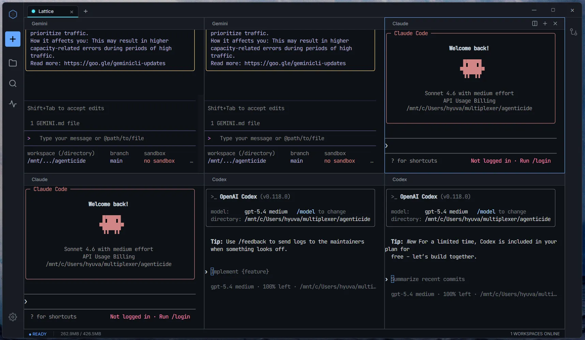
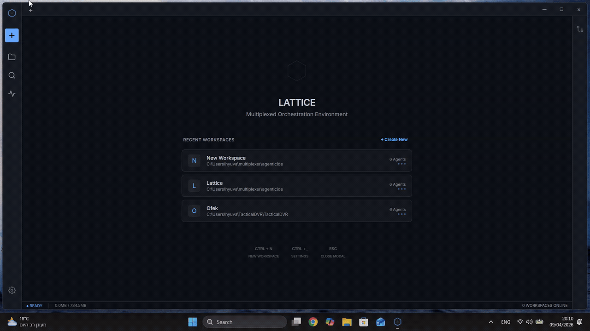
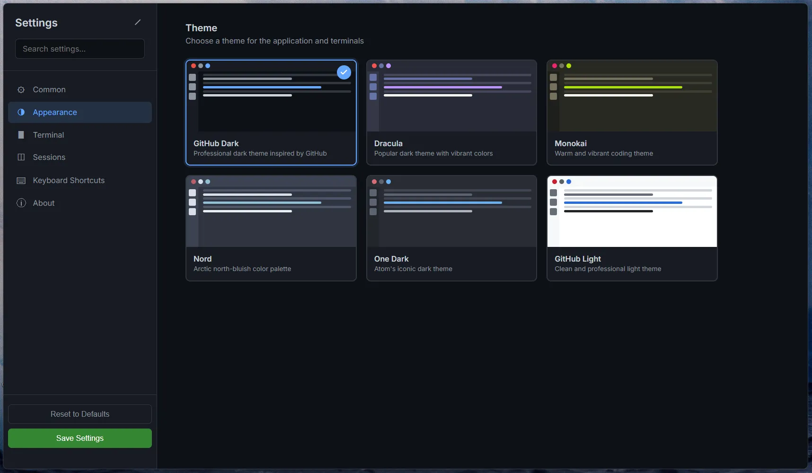
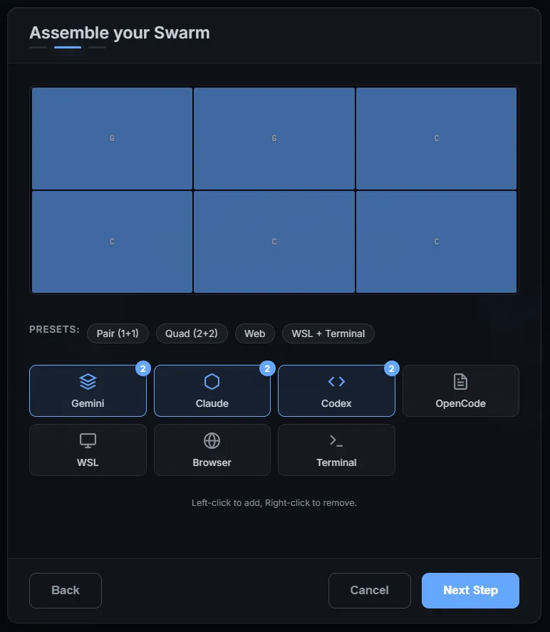
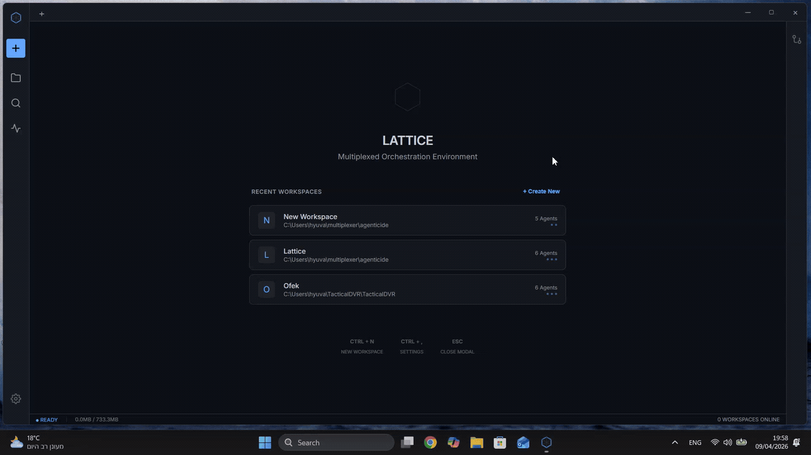
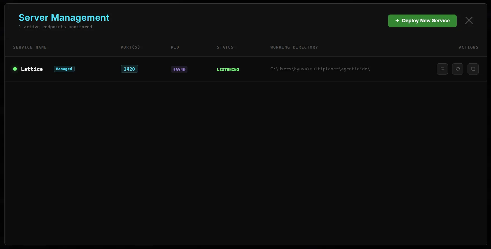
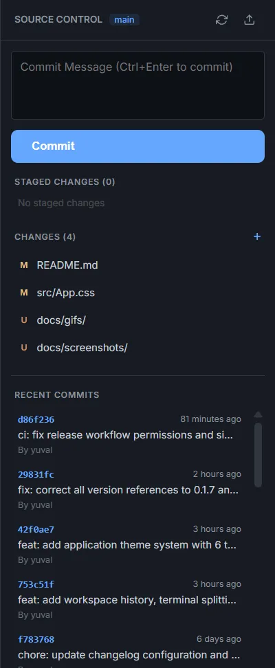

#  Lattice

[](https://github.com/YuvalHir/Lattice/releases)
[](https://yuvalhir.github.io/lattice-website/)
[](https://opensource.org/licenses/MIT)
[](https://tauri.app/)
[](https://www.rust-lang.org/)
[](https://www.solidjs.com/)

**Lattice** is a high-performance, zero-latency multiplexed orchestration environment designed for parallel AI agent swarms. Built with a Rust-powered backend and a reactive SolidJS frontend, it provides a "Zero-Scroll" workspace where terminals are perfectly tiled and synchronized.

🌐 **Live Website:** [https://yuvalhir.github.io/lattice-website/](https://yuvalhir.github.io/lattice-website/)



---

## ✨ Why Lattice?

Orchestrating multiple AI agents (like Claude, Gemini, or custom scripts) in traditional terminal tabs is cumbersome. Lattice transforms your workspace into a **reactive grid**, allowing you to monitor and interact with a "swarm" of processes simultaneously — without context switching or tab scrolling.

---

## 🚀 Key Features

### 🧩 Zero-Scroll Workspace Grid
A workspace that always fits your viewport. Terminals are perfectly adjacent with no gaps, auto-tiled for 1 to 12+ sessions.

### 🔄 Workspace History & Relaunch
Launch a previous workspace from history — no need to reconfigure. Your recent sessions are saved and one-click away.



### ✂️ Terminal Splitting & Add
Split any terminal session directly from the tile header, or add new agents to your existing workspace on the fly.


### 🎨 6 Built-in Themes
Choose from professional color palettes: **GitHub Dark**, **Dracula**, **Monokai**, **Nord**, **One Dark**, and **GitHub Light**. Themes apply to the entire UI and all terminal sessions.




### 🛡️ ESC Key Everywhere
Close any modal, dialog, or panel with a single `Escape` press. Works across launcher, settings, server manager, and more.

### 🛠 Swarm Builder
A multi-step onboarding experience to configure mixed session layouts (Gemini, Claude, Codex, OpenCode, WSL, Browser) with a live grid preview.





### 📡 Server Management
Automatically discover background services, view clean logs (ANSI-stripped), rename processes, and manage lifecycles from a dedicated panel.



### 🌳 Git First-Class Integration
Stage changes, commit, and view file diffs directly within the IDE-like interface.



### 📁 Integrated File Explorer
High-fidelity file navigation with branded icons for Rust, Python, TS, Docker, and more.

---

## 🎨 Themes

| Theme | Vibe |
| :--- | :--- |
| **GitHub Dark** | Professional & clean |
| **Dracula** | Vibrant & bold |
| **Monokai** | Warm & energetic |
| **Nord** | Calm & arctic |
| **One Dark** | Classic Atom editor feel |
| **GitHub Light** | Bright & readable |

Themes apply to the entire application — UI, terminals, panels, and modals — instantly.

---

## ⌨️ Keyboard Shortcuts

| Shortcut | Action |
| :--- | :--- |
| `Ctrl + L` / `Ctrl + N` | Open Launcher |
| `Ctrl + ,` | Open Settings |
| `Ctrl + W` | Close Current Workspace |
| `Escape` | Close Modal / Settings / Server Manager |

---

## 🛠 Tech Stack

| Component | Technology |
| :--- | :--- |
| **Backend** | Rust (Tauri v2), `portable-pty`, `tokio` |
| **Frontend** | SolidJS, TypeScript, Vite |
| **Terminal** | `xterm.js` (WebGL enabled) |
| **Styling** | Vanilla CSS + Reactive CSS Grid |
| **IPC** | Tauri Command + Event Bridge (Zero-Latency) |

---

## 📥 Getting Started

### For Users (Download)
Lattice is currently in early access (**v0.1.7**). Download the latest installers for Windows, macOS, and Linux from the [Releases](https://github.com/YuvalHir/Lattice/releases) section.

### For Developers (Build from Source)

**Prerequisites:**
- [Rust Toolchain](https://www.rust-lang.org/tools/install)
- [Node.js 18+](https://nodejs.org/)
- [Tauri Prerequisites](https://tauri.app/v1/guides/getting-started/prerequisites)

**Installation:**
```bash
# Clone the repository
git clone https://github.com/YuvalHir/Lattice.git
cd Lattice

# Install dependencies
npm install

# Run in development mode
npm run tauri dev
```

---

## 🏗 Architecture Overview

Lattice uses a thread-safe, centralized **Session Registry** in Rust to track active terminals.

- **Global State**: Managed via `Arc<Mutex<SessionRegistry>>`.
- **I/O Pipeline**: Dedicated `tokio` tasks monitor process `stdout/stderr` and emit raw byte streams to the frontend via Tauri events.
- **OS Bridge**: Seamlessly abstracts execution between Native Windows (`cmd`/`powershell`) and WSL, with robust process lifecycle management.

For a deep dive, see:
- [Backend Architecture](docs/ARCHITECTURE_BACKEND.md)
- [Frontend Architecture](docs/ARCHITECTURE_FRONTEND.md)
- [IPC & Data Flow](docs/ARCHITECTURE_IPC_AND_DATA.md)

---

## 🔖 Versioning & Releases

We follow [Semantic Versioning (SemVer)](https://semver.org/).
- **Major**: Breaking changes.
- **Minor**: New features (e.g., themes, workspace history).
- **Patch**: Bug fixes and performance tweaks.

Check our [Changelog](CHANGELOG.md) for detailed release notes.

---

## 📄 License

This project is licensed under the **MIT License** - see the [LICENSE](LICENSE) file for details.

---

<p align="center">
  Built with ❤️ for the AI Agent Community by <a href="https://github.com/YuvalHir">YuvalHir</a>
</p>
