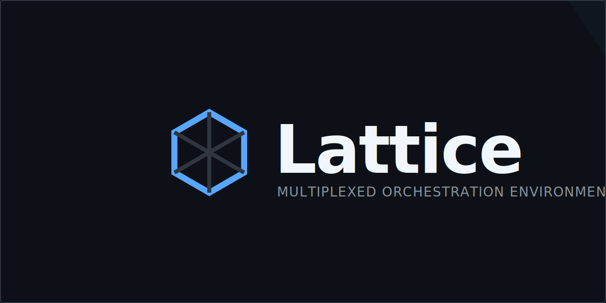

#  Lattice

[](https://github.com/YuvalHir/Lattice/releases)
[](https://opensource.org/licenses/MIT)
[](https://tauri.app/)
[](https://www.rust-lang.org/)
[](https://www.solidjs.com/)

**Lattice** is a high-performance, zero-latency multiplexed orchestration environment designed for parallel AI agent swarms. Built with a Rust-powered backend and a reactive SolidJS frontend, it provides a "Zero-Scroll" workspace where terminals are perfectly tiled and synchronized.



---

## ✨ Why Lattice?

Orchestrating multiple AI agents (like Claude, Gemini, or custom scripts) in traditional terminal tabs is cumbersome. Lattice transforms your workspace into a **reactive grid**, allowing you to monitor and interact with a "swarm" of processes simultaneously without context switching.

## 🚀 Key Features

- **🧩 The Grid (Zero-Scroll)**: A workspace that always fits your viewport. Terminals are perfectly adjacent with no gaps, optimized for 4, 6, 8, or 12+ sessions.
- **⚡ PTY-Backed Performance**: Utilizing `portable-pty` and Rust's `tokio` for near-zero latency I/O.
- **🛠 Swarm Builder**: A multi-step onboarding experience to configure mixed session layouts (Native, WSL, Browser) with a live grid preview.
- **📁 Integrated Workspace Explorer**: High-fidelity file navigation with branded icons for Rust, Python, TS, Docker, and more.
- **📡 Server Management**: Automatically discover background services, view clean logs (ANSI-stripped), and manage process lifecycles.
- **🌳 Git First-Class**: Stage changes, commit, and view history directly within the IDE-like interface.
- **🎨 Modern Aesthetics**: Standardized on the **Campbell (PowerShell)** theme with **Cascadia Code** and WebGL-accelerated rendering via `xterm.js`.

---

## 🛠 Tech Stack

| Component | Technology |
| :--- | :--- |
| **Backend** | Rust (Tauri v2), `portable-pty`, `tokio` |
| **Frontend** | SolidJS, TypeScript, Vite |
| **Terminal** | `xterm.js` (WebGL enabled) |
| **Styling** | Vanilla CSS + Reactive CSS Grid |
| **IPC** | Tauri Command + Event Bridge (Zero-Latency) |

---

## 📥 Getting Started

### For Users (Download)
Lattice is currently in early access (**v0.1.2**). You can find the latest installers for Windows and Linux in the [Releases](https://github.com/YuvalHir/Lattice/releases) section.

### For Developers (Build from Source)

**Prerequisites:**
- [Rust Toolchain](https://www.rust-lang.org/tools/install)
- [Node.js 18+](https://nodejs.org/)
- [Tauri Prerequisites](https://tauri.app/v1/guides/getting-started/prerequisites)

**Installation:**
```bash
# Clone the repository
git clone https://github.com/YuvalHir/Lattice.git
cd Lattice

# Install dependencies
npm install

# Run in development mode
npm run tauri dev
```

---

## 🏗 Architecture Overview

Lattice uses a thread-safe, centralized **Session Registry** in Rust to track active terminals.
- **Global State**: Managed via `Arc<Mutex<SessionRegistry>>`.
- **I/O Pipeline**: Dedicated `tokio` tasks monitor process `stdout/stderr` and emit raw byte streams to the frontend via Tauri events.
- **OS Bridge**: Seamlessly abstracts execution between Native Windows (`cmd`/`powershell`) and WSL.

For a deep dive, see:
- [Backend Architecture](docs/ARCHITECTURE_BACKEND.md)
- [Frontend Architecture](docs/ARCHITECTURE_FRONTEND.md)
- [IPC & Data Flow](docs/ARCHITECTURE_IPC_AND_DATA.md)

---

## 🔖 Versioning & Releases

We follow [Semantic Versioning (SemVer)](https://semver.org/). 
- **Major**: Breaking changes.
- **Minor**: New features (e.g., New session types).
- **Patch**: Bug fixes and performance tweaks.

Check our [Changelog](CHANGELOG.md) for detailed release notes.

---

## 📄 License

This project is licensed under the **MIT License** - see the [LICENSE](LICENSE) file for details.

---

<p align="center">
  Built with ❤️ for the AI Agent Community by <a href="https://github.com/YuvalHir">YuvalHir</a>
</p>
